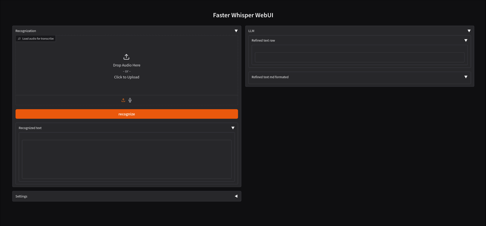
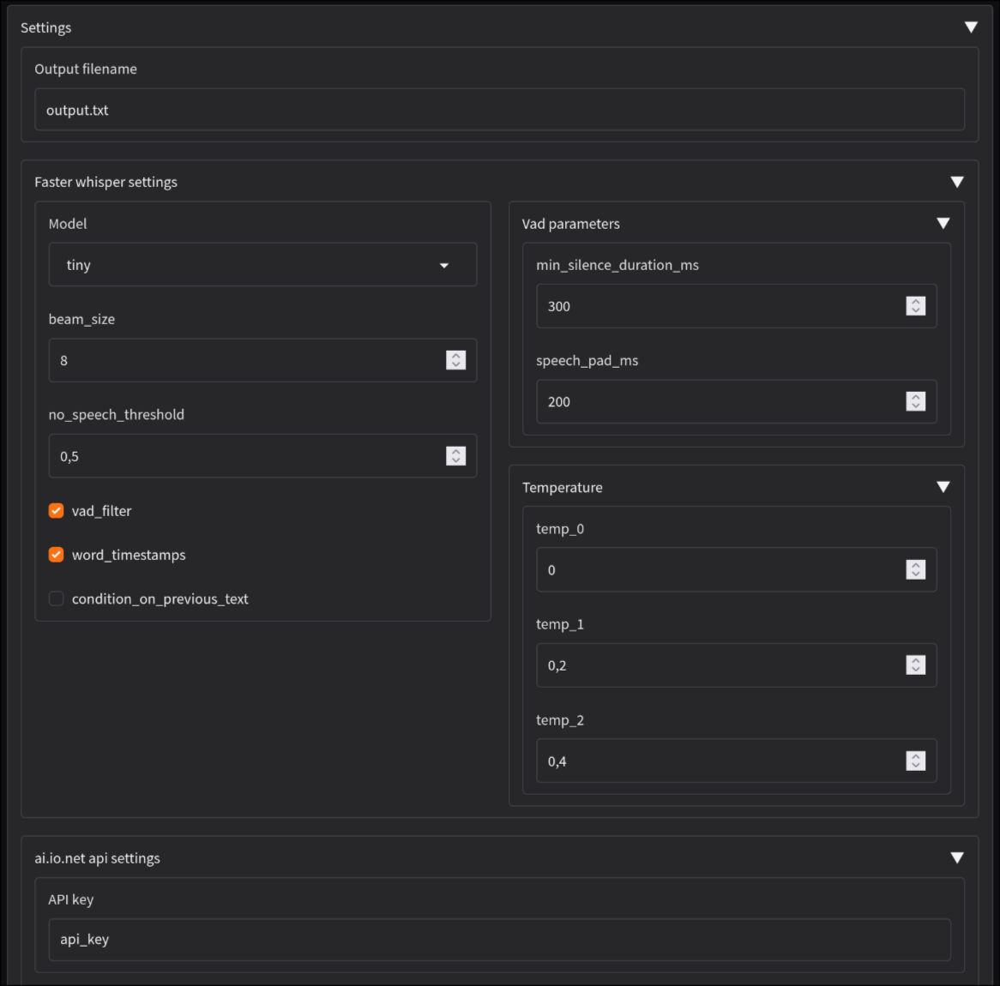
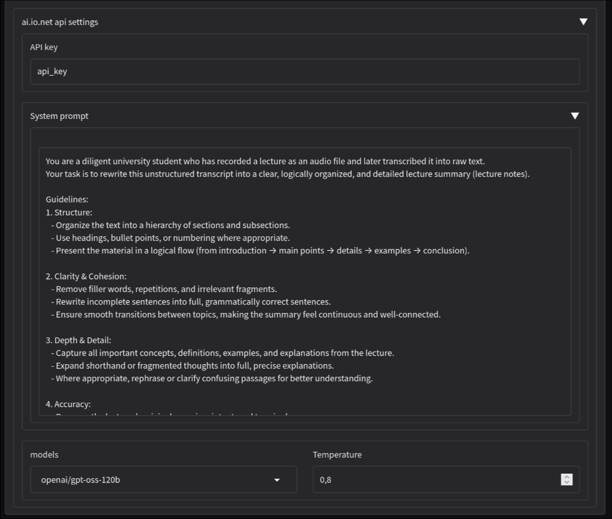

# FWAL WebUI (Faster Whisper And LLM WebUI) by swrneko

<div align="center">
  
</div>

## Screenshots
<div align="center">
  <div>
    
  </div>
  <div style="align-items: center;">
    
    
  </div>
</div>


## Requirements
  - python-conda or miniconda;
  - python 3.10 or above;
  - linux (windows not tested but probably working);

  Python requirements are listed in `requirements.txt`.

## Installation
1. Clone repository:
  ```
  git clone https://github.com/swrneko/faster-whisper-n-ionet-llm.git
  cd faster-whisper-n-ionet-llm
  ```

2. Create virtual env:
  ```
  conda create -n faster-whisper-n-ionet-llm python=3.10
  conda activate faster-whisper-n-ionet-llm
  conda install nvidia::cudnn cuda-version=12
  ```

3. Install requirements:
  ```
  pip install -r requirements.txt
  ```

4. Get api key from [io.net](https://ai.io.net/ai/api-keys) and insert into `.env` file (need to create it in root of repository directory).
It should looks like this:
  ```
  API_KEY='your_api_key_without_qoutes'  
  ```

5. Done! Now you can just run it like that:
  ```shell
  python app.py
  ```
